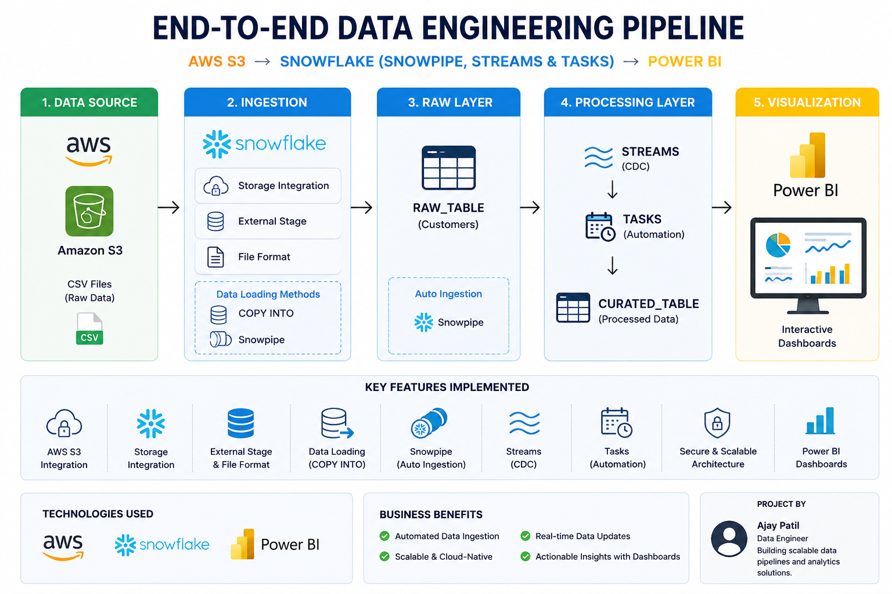

# ❄️ End-to-End Data Engineering Pipeline
## AWS S3 → Snowflake → Power BI

<p align="center">



</p>

---

## 📌 Overview

This project demonstrates an end-to-end cloud-native Data Engineering pipeline built using **AWS S3**, **Snowflake**, **SQL**, and **Power BI**.

The solution securely ingests CSV data from Amazon S3 into Snowflake using **Storage Integration**, supports **Batch Loading (COPY INTO)** and **Auto Ingestion (Snowpipe)**, captures data changes using **Streams (CDC)**, automates ETL workflows with **Tasks**, and visualizes insights in **Power BI**.

---

# 🚀 Project Architecture

```
Amazon S3
     │
     ▼
Storage Integration
     │
     ▼
External Stage
     │
     ▼
COPY INTO / Snowpipe
     │
     ▼
Customer Table
     │
     ▼
Streams (CDC)
     │
     ▼
Tasks (Automation)
     │
     ▼
Curated Table
     │
     ▼
Power BI Dashboard
```

---

# 🛠️ Tech Stack

| Technology | Purpose |
|------------|---------|
| AWS S3 | Raw Data Storage |
| Snowflake | Cloud Data Warehouse |
| SQL | Data Transformation |
| Snowpipe | Automatic Data Loading |
| Streams | Change Data Capture (CDC) |
| Tasks | Workflow Automation |
| Power BI | Dashboard & Reporting |

---

# ✨ Features

- ✅ AWS S3 Storage Integration
- ✅ External Stage
- ✅ CSV File Format
- ✅ COPY INTO (Batch Loading)
- ✅ Snowpipe (Auto Ingestion)
- ✅ Streams (CDC)
- ✅ Tasks (Automation)
- ✅ SQL Transformations
- ✅ Power BI Dashboard

---

# 📂 Repository Structure

```
snowflake-s3-powerbi-data-pipeline
│
├── README.md
├── LICENSE
│
├── images
│   └── architecture.png
│
├── sql
│   └── 01_end_to_end_pipeline.sql
```

---

# 📈 Workflow

1. Upload CSV files to AWS S3
2. Configure Storage Integration
3. Create External Stage
4. Load data using COPY INTO
5. Configure Snowpipe
6. Capture changes using Streams
7. Automate processing using Tasks
8. Create reporting views
9. Connect Power BI
10. Build Interactive Dashboard

---

# 📷 Screenshots

### Architecture


---

# 👨‍💻 Author

### Ajay Patil

**Data Engineering Enthusiast**

### Skills

- SQL
- Snowflake
- AWS
- PySpark
- Power BI
- Python

---

# ⭐ If you like this project, don't forget to star this repository.
